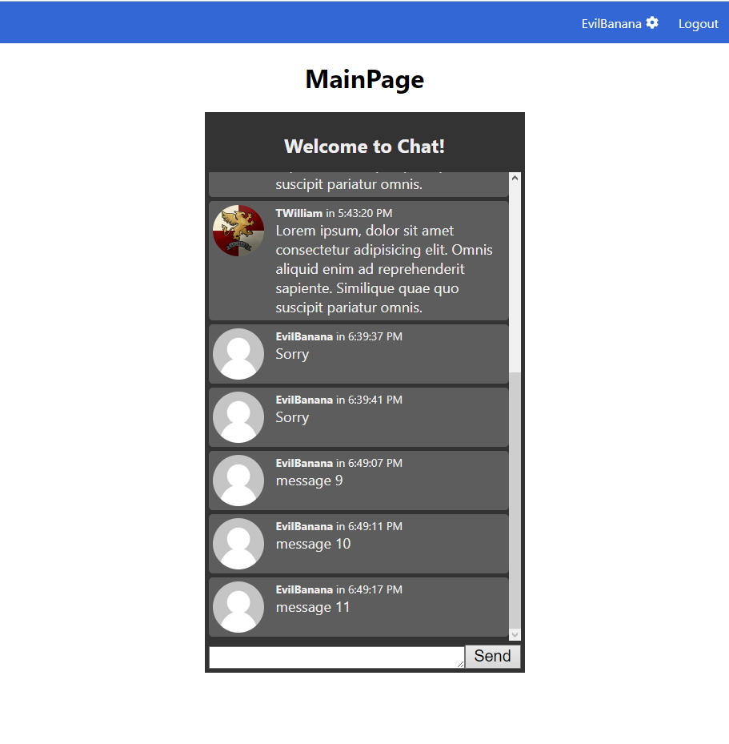
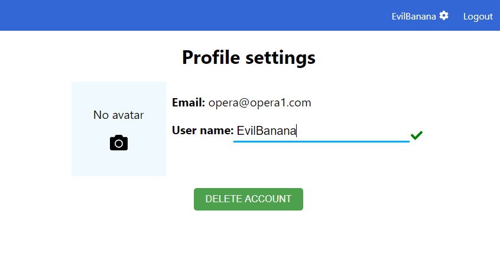

# Auth-App
Примитивный чат на вебсокетах
- Клиент: React + React Hooks
- Сервер: Express + Mongoose
- Для чата используется Socket Io
- Для подтверждения действий используется система из двух jwt токенов
- Обработка изображений (возможность поставить аватар)

